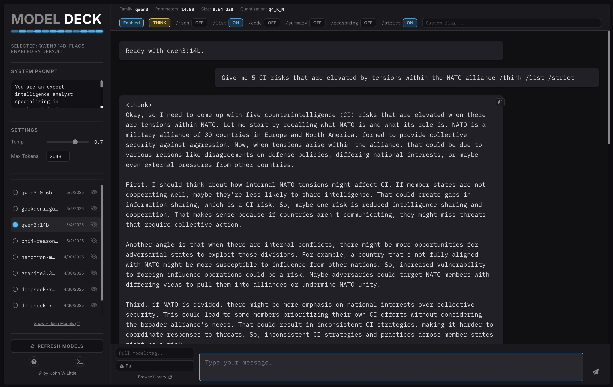

[](https://creativecommons.org/licenses/by-nc/4.0/)

# Model Deck

**by [John W Little](https://johnwlittle.com)**

## Rationale

Running large language models locally using Ollama is incredibly powerful, offering privacy, speed, and customization. While excellent, comprehensive interfaces like [Open WebUI](https://github.com/open-webui/open-webui) offer a vast array of features and likely suit most users best for general use, I found myself wanting a more streamlined, single-file web interface.

My specific goals were to create a simple platform primarily for my own future projects and experimentation, focusing on easily:

* Seeing all my locally available Ollama models at a glance.
* Quickly switching between different models for testing and comparison.
* Adjusting common generation parameters like temperature and max tokens.
* Providing system prompts easily.
* Pulling new models from the library without dropping back to the command line.
* Having a clean, focused chat interface.
* Controlling specific model features using command flags.

**Model Deck** is the result – a self-contained single HTML file providing a focused UI for these common Ollama interactions. I'm releasing this version for others who might find this specific feature set useful, prefer a simpler approach, or want a basic foundation to build upon.

## Features

* **List Local Models:** Automatically fetches and displays models available in your local Ollama installation.
* **Model Selection:** Click to select any available model for chatting.
* **Chat Interface:** Standard chat UI with streaming responses from the selected model.
* **Parameter Adjustment:** Sliders/Inputs to control Temperature and Max Tokens (sent with each request).
* **System Prompt:** Dedicated input for setting a system prompt for the current session.
* **Copy Responses:** Easily copy the full text of any AI response using the copy button.
* **Pull Models:** Input field and button to pull new models from the Ollama library directly (e.g., `llama3:latest`). Handles streaming progress display.
* **Hide/Show Models:** Temporarily hide models from the UI list using the <i class="fa-solid fa-eye-slash"></i> icon. Hidden models persist across sessions (using localStorage) and can be restored using the "Show Hidden Models" button.
* **Model Details:** Displays basic model details (Family, Parameters, Size, Quantization) when a model is selected, if available from the API.
* **Command Flags Bar:** (New/Updated)
    * A distinct horizontal bar located directly below the Model Details bar, always visible in the UI structure after initialization.
    * **Master Enable Button:** The first control in the bar. This button controls whether the rest of the flags in the bar are active for the current message. Its text changes based on state ("Enable" or "Enabled"). It defaults to "Enabled" for models with 'qwen' in their name, and "Enable" otherwise, but can be manually toggled.
    * **Thinking Flag Toggle:** A dedicated, multi-state button for the thinking command. It cycles through three modes on click:
        * **DEFAULT:** No specific thinking flag (`/think` or `/no_think`) is sent. The model uses its inherent default behavior. (Button text: "DEFAULT") Defaults to this state for non-'qwen' models.
        * **THINK:** The `/think` flag is sent. (Button text: "THINK", visually active)
        * **NO THINK:** The `/no_think` flag is sent. (Button text: "NO THINK", visually active) Defaults to this state for 'qwen' models.
    * **Standard Flag Toggles:** Simple ON/OFF toggle buttons for other predefined flags (e.g., `/json`, `/list`, `/code`, `/summary`, `/reasoning`, `/strict`). (Button text: "ON"/"OFF", visually active when ON). All default to OFF.
    * **Custom Flag Input:** A text input field allowing the user to type any custom flag text (e.g., `/custom_command`). Defaults to empty.
    * Flags are only appended to the prompt if the Master Enable button is in the "Enabled" state. Appended flags are added after the user's main prompt text.
* **Informational Modals:**
    * Getting Started guide (<i class="fa-solid fa-circle-question"></i> button).
    * Ollama CLI quick reference (<i class="fa-solid fa-terminal"></i> button).
* **Visual Theme:** Dark, tech-inspired interface.
* **Self-Contained:** Runs entirely as a single HTML file (when served locally).

## Screenshot



## Getting Started

This application allows you to chat with large language models running locally via Ollama.

#### Prerequisites:

* **Ollama Installed & Running:** You need the Ollama application installed and running on your computer. Download it from [ollama.com](https://ollama.com) and follow their installation instructions. Make sure the Ollama server is running (it usually starts automatically after installation).
* **Models Downloaded:** You need at least one model downloaded through Ollama. Open your terminal or command prompt and run `ollama pull llama3` (or replace `llama3` with another model name like `mistral`, `gemma:2b`, etc.). You can also use the "Pull model:tag..." input in this app (bottom left).

#### How to Run This App:

1.  **Save this File:** Save this page as `index.html`.
2.  **Need a Local Web Server (Recommended):** Opening this file directly (`file:///...`) often fails due to browser security rules (CORS) that block requests to Ollama at `http://localhost:11434`. The most reliable way is to use a simple local server:
3.  **Start Server (Pick One):**
    a.  Open your Terminal (macOS/Linux) or Command Prompt/PowerShell (Windows).
    b.  Navigate to the directory where you saved `index.html` using the `cd` command (e.g., `cd Downloads` or `cd path/to/folder`).
    c.  **If Python 3 is installed:** Run this command:
        ```bash
        python3 -m http.server 8000
        ```
        (On some systems, you might need to use `python` instead of `python3`). Note the port number (8000).
    d.  **If Node.js/npm is installed:** Run this command:
        ```bash
        npx serve .
        ```
        (This usually serves on port 3000. If it asks to install 'serve', type 'y').
4.  **Access in Browser:** Open your web browser and go to
    `http://localhost:8000` (or the port number your server command indicated, like 3000).
5.  **Stop the Server:** When finished, go back to the terminal window where you started the server and press `Ctrl + C`.

#### Using the App Interface:

* Select a model from the list on the left.
* View model details (if available) above the chat area.
* **Command Flags Bar:** This bar is always visible below the model details.
    * The first button ("Enable"/"Enabled") activates/deactivates all flags for the current message. It defaults to "Enabled" for 'qwen' models, "Enable" otherwise, but you can toggle it manually.
    * The "Thinking" button cycles: DEFAULT (model's choice), THINK (force `/think`), NO THINK (force `/no_think`). It defaults to NO THINK for 'qwen' models, DEFAULT otherwise.
    * Other buttons toggle specific flags (like `/json`) ON/OFF.
    * The input box lets you add a custom flag.
    * Flags are only sent if the first button is "Enabled".
* Adjust settings or add a system prompt in the sidebar.
* Chat using the input box at the bottom right.
* Pull new models using the input box at the bottom left.
* Hide models from the list using the <i class="fa-solid fa-eye-slash"></i> icon. Restore them with the "Show Hidden Models" button.

## Ollama CLI Quick Reference

Common commands for managing Ollama from your terminal:

* `ollama pull <model>`: Downloads a model (e.g., `ollama pull llama3`).
* `ollama run <model>`: Starts an interactive chat session with a model (pulls if necessary).
* `ollama list`: Lists all models downloaded to your machine.
* `ollama ps`: Shows models currently running in memory.
* `ollama show <model>`: Shows details about a specific model.
* `ollama cp <src> <dest>`: Creates a copy of an existing model.
* `ollama rm <model>`: Deletes a downloaded model.
* `ollama create <name> -f <Modelfile>`: Creates a custom model from a Modelfile.
* `ollama serve`: Starts the Ollama server manually (if not running as a service).
* `ollama help`: Displays help information.

For more details, check the [official Ollama documentation](https://github.com/ollama/ollama) on GitHub.

## Source / Development

This application is contained within a single HTML file including CSS and JavaScript. You can modify it directly.
