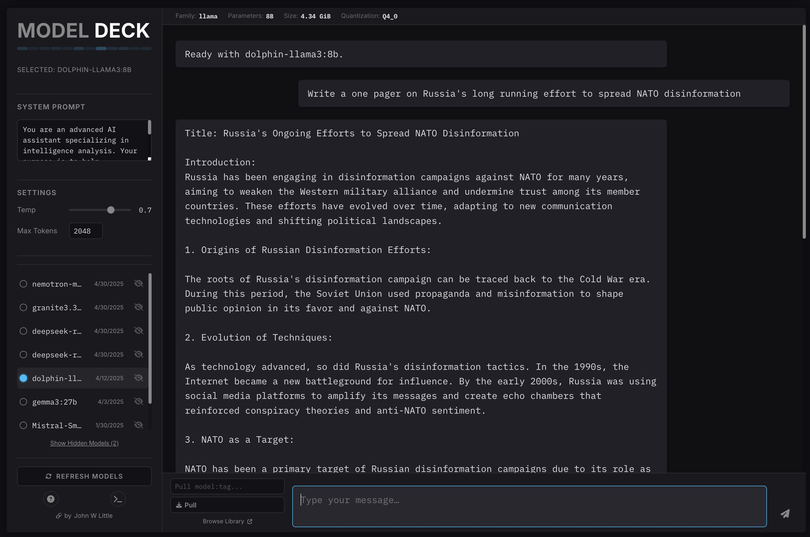

[](https://creativecommons.org/licenses/by-nc/4.0/)

# Model Deck

**by [John W Little](https://johnwlittle.com)**

## Rationale

Running large language models locally using Ollama is incredibly powerful, offering privacy, speed, and customization. While excellent, comprehensive interfaces like [Open WebUI](https://github.com/open-webui/open-webui) offer a vast array of features and likely suit most users best for general use, I found myself wanting a more streamlined, single-file web interface.

My specific goals were to create a simple platform primarily for my own future projects and experimentation, focusing on easily:

* Seeing all my locally available Ollama models at a glance.
* Quickly switching between different models for testing and comparison.
* Adjusting common generation parameters like temperature and max tokens.
* Providing system prompts easily.
* Pulling new models from the library without dropping back to the command line.
* Having a clean, focused chat interface.
* Controlling specific model features like Qwen3's command flags.

**Model Deck** is the result – a self-contained single HTML file providing a focused UI for these common Ollama interactions. I'm releasing this version for others who might find this specific feature set useful, prefer a simpler approach, or want a basic foundation to build upon.

## Features

* **List Local Models:** Automatically fetches and displays models available in your local Ollama installation.
* **Model Selection:** Click to select any available model for chatting.
* **Chat Interface:** Standard chat UI with streaming responses from the selected model.
* **Parameter Adjustment:** Sliders/Inputs to control Temperature and Max Tokens (sent with each request).
* **System Prompt:** Dedicated input for setting a system prompt for the current session.
* **Copy Responses:** Easily copy the full text of any AI response using the copy button.
* **Pull Models:** Input field and button to pull new models from the Ollama library directly (e.g., `llama3:latest`). Handles streaming progress display.
* **Hide/Show Models:** Temporarily hide models from the UI list using the <i class="fa-solid fa-eye-slash"></i> icon. Hidden models persist across sessions (using localStorage) and can be restored using the "Show Hidden Models" button.
* **Model Details:** Displays basic model details (Family, Parameters, Size, Quantization) when a model is selected, if available from the API.
* **Qwen3 Flags Bar:** Automatically appears below the model details when a model containing 'qwen3' in its name is selected. Provides toggles for specific command flags: `/thinking`, `/json`, `/list`, `/code`, `/summary`, `/reasoning`, `/strict`.
* **Flag Toggling:** All flags default to OFF visually. Active flags are appended to the prompt. For `/thinking`, OFF sends `/no_think` (to override the model's default thinking), ON sends `/think`. For other flags, OFF sends nothing, ON sends the flag itself.
* **Informational Modals:**
    * Getting Started guide (<i class="fa-solid fa-circle-question"></i> button).
    * Ollama CLI quick reference (<i class="fa-solid fa-terminal"></i> button).
* **Visual Theme:** Dark, tech-inspired interface.
* **Self-Contained:** Runs entirely as a single HTML file (when served locally).

## Screenshot



## Getting Started

This page lets you chat with Ollama models running on your computer.

#### Prerequisites:

* **Ollama Installed & Running:** You must have the Ollama application installed and running. Download from [ollama.com](https://ollama.com) and follow their installation instructions. Usually, Ollama runs automatically as a background service after installation. You can check if it's running by opening your terminal and typing `ollama list`.
* **Models Downloaded:** You need at least one model. In your terminal, type `ollama pull llama3` (or `mistral`, `gemma:2b`, etc.). You can also use the Pull input in this app (bottom left). A Qwen3 model (e.g., `ollama pull qwen3`) is needed to see the special Flags Bar.

#### How to Run This App:

1.  **Save this File:** Save the application code as `model_deck.html` (or any name ending in `.html`).
2.  **Run a Local Web Server (Required):** Opening this HTML file directly from your computer (`file:///...`) will likely **fail** due to browser security rules (CORS). These rules prevent the page from making requests to the Ollama API running on `http://localhost:11434`. The reliable way to run this app is using a simple local web server.
3.  **Start Server (Pick One Option):**
    a. Open your **Terminal** (on macOS/Linux) or **Command Prompt / PowerShell** (on Windows).
    b. Navigate to the directory where you saved `model_deck.html` using the `cd` command (e.g., `cd Downloads` or `cd path/to/your/folder`).
    c. **Option 1: Python 3 (Recommended, often built-in):**
    Run the command:
    ```bash
    python3 -m http.server 8000
    ```
    *(If `python3` doesn't work, try `python -m http.server 8000`)*. Note the port number (e.g., `8000`).
    d. **Option 2: Node.js/npm (If installed):**
    Run the command:
    ```bash
    npx serve .
    ```
    *(If it asks to install `serve`, type `y` and press Enter)*. Note the port number it provides (often 3000).
4.  **Access in Browser:** Open your web browser (Chrome, Firefox, Edge, etc.) and navigate to:
    `http://localhost:8000`
    *(Replace `8000` with the port number your server command indicated, if different)*.
5.  **Stop the Server:** When you are finished using the app, go back to the terminal window where you started the server and press `Ctrl + C`.

#### Using the App Interface:

* Select a model from the list on the left.
* View model details (if available) which appear above the chat area.
* **Qwen3 Flags Bar:** If you select a Qwen3 model, use the flags bar that appears below the model details to toggle command flags ON/OFF. All flags *look* OFF by default.
    * For `/thinking`: OFF sends `/no_think` (overriding model default), ON sends `/think`.
    * For other flags: OFF sends nothing, ON sends the flag (e.g. `/json`).
    * Active flags are appended to your prompt.
* Adjust settings or add a system prompt in the sidebar.
* Chat using the input box at the bottom right.
* Pull new models using the input box at the bottom left.
* Hide models from the list using the <i class="fa-solid fa-eye-slash"></i> icon. Restore them with the "Show Hidden Models" button.

## Ollama CLI Quick Reference

Common commands for managing Ollama from your terminal:

* `ollama pull <model>`: Downloads a model (e.g., `ollama pull llama3`).
* `ollama run <model>`: Starts an interactive chat session with a model (pulls if necessary).
* `ollama list`: Lists all models downloaded to your machine.
* `ollama ps`: Shows models currently running in memory.
* `ollama show <model>`: Shows details about a specific model.
* `ollama cp <src> <dest>`: Creates a copy of an existing model.
* `ollama rm <model>`: Deletes a downloaded model.
* `ollama create <name> -f <Modelfile>`: Creates a custom model from a Modelfile.
* `ollama serve`: Starts the Ollama server manually (if not running as a service).
* `ollama help`: Displays help information.

For more details, check the [official Ollama documentation](https://github.com/ollama/ollama) on GitHub.

## Source / Development

This application is contained within a single HTML file including CSS and JavaScript. You can modify it directly.
